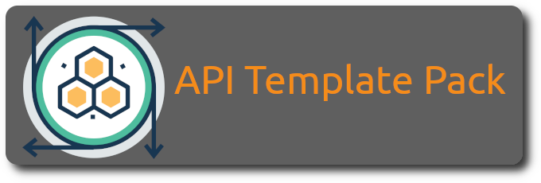

  

   

The API Template pack provides an opinionated implementation guide to making use of popular leading .net framework based tools and utilities to assist developers to quickly and efficiently develop secure, stable and resilient REST API’s.

REST API framework for ASP.Net 7 that implements [REPR (Request-Endpoint-Response) Pattern](https://www.apitemplatepack.com/docs/introduction/repr-pattern/) and [Vertical Slice Architecture](https://www.apitemplatepack.com/docs/introduction/vertical-slice/).

The API Template Pack provides an opinionated approach to implementing best practices and pattern based approaches to implementing Web Based REST API's using Dotnet 7, using the best available open source libraries enabling you to focus on just implementing the real value added business logic.

Check out the Documentation [apitemplatepack.com](https://www.apitemplatepack.com "API Template Pack")

## Give a Star! :star:

If you like or are using this project to learn or start your solution, please give it a star.

This helps us to understand and learn how to improve the project over time.

## Feedback

We would certainly appreciate feedback and learning how you are making use of this project. 

Please read our [Guide to contributing](https://github.com/threenine/api-template/blob/master/CONTRIBUTING)

We have enabled the [Github discussions](https://github.com/threenine/api-template/discussions) on this repository so please feel free to ask any questions, propose ideas etc over there and we will respond as soon as possible.

If you find any issues, bugs or would like additional features the open a an Issue on the [Issue Board](https://github.com/threenine/api-template/issues) and you will be able to track the progress of the issue on the [Project Board](https://github.com/orgs/threenine/projects/3)

## Change log

Details of changes per release can be found at the [Change log](https://www.apitemplatepack.com/docs/changelog)

