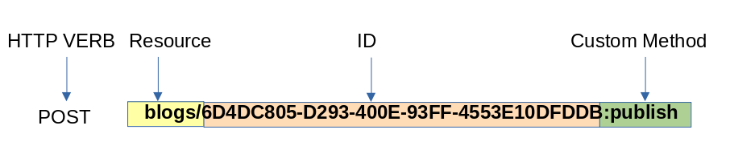

The API Template Pack leads down to an opinionated path to implementing a [CQRS pattern](https://garywoodfine.com/what-is-cqrs/ "What is CQRS - Gary Woodfine"), the real benefits of introducing this pattern will come to fruition in later versions of the API Template Pack when we start delving more into the Microservices, Event-Storming and the Event-Driven Architecture aspects of the API Template Pack. However, at this early stage it is still quite important to understand the fundamental basics of CQRS and the how and why the API Template Pack starts you on the path from the very beginning.

### Splitting Models into Read & Write Operations

At its most fundamental basic level the CQRS pattern primary focus is primarily focused on ensuring the splitting up your read and write models.  The primary concept is that the way you read data probably will in all likelihood look entirely different to the way that it is written. And trying to use the same models for both can lead to a lot of bloat that can be confusing. 

For the most part CQRS does not necessarily have any opinionated solution in regards to the databases etc. , although many may think the pattern itself implies you need different Write AND Read datastores.  This is most definitely not the case.  However, depending on the complexity and requirements of your project CQRS can be and is used to fulfil this kind of architecture, but it is by no means a hard requirement.

### Commands & Queries

In CQRS Write & Read operations are defined as  Commands & Queries

#### Commands

A Command is an operation that can mutate the data without returning a value. Which are essentially any write operations, such as **Create**, **Update** and **Delete** operations.

#### Queries

Queries are operations that will never mutate data and will always return values and mostly comprise of **Read** operations.


The API Template Pack steers you down the path of helping you to generate Commands & Queries folders for your endpoints and will also assist in helping you to generate individual folders for each command and query objects.  This ensures the implementation of the **Single Responsibility Principle** , which is also a leading concept within the implementation of the logic itself.  Each class within the Endpoint has a Single Responsibility, and only provides the functionality required to fulfil its purpose.  All classes combined combined together fulfil the purpose of the endpoint, but individually they only fulfil their specific purpose. These purposes are:

- Endpoint
- Validation
- Mapping
- Handler 
- Request 
- Response

In each of the endpoints developed the _Request_ object is typically named as the either *Command* or *Query* this is done to enforce logical comprehension and manifest to the developer of what they are developing.

### Domain Driven Design

The API Template Pack may at first provide a misconception that it steers you away from implementing Domain Driven Design(DDD), however it does in many ways actually steer you down the path of a DDD.  One of the concepts we borrow rather heavily from DDD is the concept of *Ubiquitos Language*

### Ubiquitos Language

> A project needs a common language that is more robust than the lowest common denominator. With a conscious effort by the team, the domain modelcan provide the backbone for that common language, while connecting team communication to the software implementation. **The language can be ubiquitous in the team's work**
> 

In API development and more so in [Resource-Based API Design](https://www.apitemplatepack.com/docs/introduction/resource-based-api/ "Resource-Based API - API Template Pack") this language is primarily focused on Resources provided by the API and the operations that can be executed on the resources, which are primarily the **4 Verbs: Create, Read, Update and Delete**

By narrowing the language of the project to Resource and 4 Verbs helps everyone to effectively communicate across the project effectively and even the code becomes easier to manage and communicate to other stakeholders.

In the API Template Pack we further expand on this notion by including a majority of the REST Verbs into the vocabulary:

* GET
* POST
* PUT
* PATCH
* DELETE
* OPTIONS

Typically most Resource Endpoints can be broken down to the following

```shell
├── Resource 
│   └── Commands
│       └── POST
│       └── PATCH
│       └── PUT
│       └── DELETE
│   └── Queries
│       └── GET
│       └── GETALL
│       └── OPTIONS
```

The API template pack simplifies the return value types to be expected from the standard methods with the focus of delivering _unsurprising API's_ or consistent API's

> Unsurprising API's rely on repeated patterns applied to both API surface definition and the behaviour
> 
> [API Design Patterns](https://amzn.to/3BM12ZV)

To this end API template steers you down the path of attempting to ensure all methods follow a standard return codes and error codes.

| Verb | Action | Success | Failure |
|--|--------|---------|---------|
| GET |  Fetches a record or set of resources       | 200     | 404     |
| POST |  creates a resource      |    201     |    404, 409     |
| PUT |  Updates or replaces the given record      |  200, 204      |   404      |
| PATCH  |  modifies or partially updates a given record     |  200, 204       |   404      |
| DELETE |  Deletes the given resource      |   200      |    404     |
| OPTIONS | Fetches all available REST operations | 200 | - |


### Custom HTTP Methods

In chapter 9 of the [API Design Patterns](https://amzn.to/3vMrVcC) introduces the concept of _Custom Methods_ which are typically actions that cannot be expressed as one of the standard methods. While these behaviours could technically be handled by a resource standard method the bahavourial requirements of these operations would be quite out of place for a standard method.

To address this API Template Pack helps to safely and predictably support these actions on a Web API while maintaining a simple, predictable and functional API using *custom methods*

#### Implementation 

Custom Methods look just like standard methods, although there are a few differences, one being the format of the HTTP request.  While standard methods rely on a combination of the request path and the HTTP method to indicate the behaviour of the method i.e. PATCH on a resource always indicates an update standard method.  Custom Methods cannot rely on the same mechanism. Primarily, because HTTP verbs are quite limited in their scope.

Custom Methods have their own special format that puts the relevant information in the path of the request.

There are basic rules to follow when implementing Custom Methods.

1. Custom methods almost always use POST HTTP method. There are some very rare occasions where GET Or DELETE HTTP methods may be used.
2. We use a Colon character `:` to indicate the resource has ended and the custom method has begun.

Custom methods are nothing more than API calls that fall outside the scope of a standard method and therefore aren't subject to the strict requirements that we impose on standard methods.



New Custom Methods can easily be generated by making use of the [Command Endpoint](https://www.apitemplatepack.com/docs/start/command-endpoint/) template


### Additional Resources

- [CQRS Documents by Greg Young](https://cqrs.files.wordpress.com/2010/11/cqrs_documents.pdf "CQRS Documents by Greg Young")
- [Book Review: Domain Driven Design](https://garywoodfine.com/book-review-domain-driven-design "Book Review: Domain Driven Design - Gary Woodfine")
- [Book Review: Implementing Domain Driven Design](https://garywoodfine.com/book-review-implementing-domain-driven-design "Book Review: Implementing Domain Driven Design - Gary Woodfine")
- [Book Review: API Design Patterns](https://garywoodfine.com/book-review-api-design-patterns/ "Book Review: API Design Patterns - Gary Woodfine")
- [Book Review: Principles of Web API Design](https://garywoodfine.com/book-review-principles-of-web-api-design/ "Book Review: Principles of Web API Design - Gary Woodfine")


