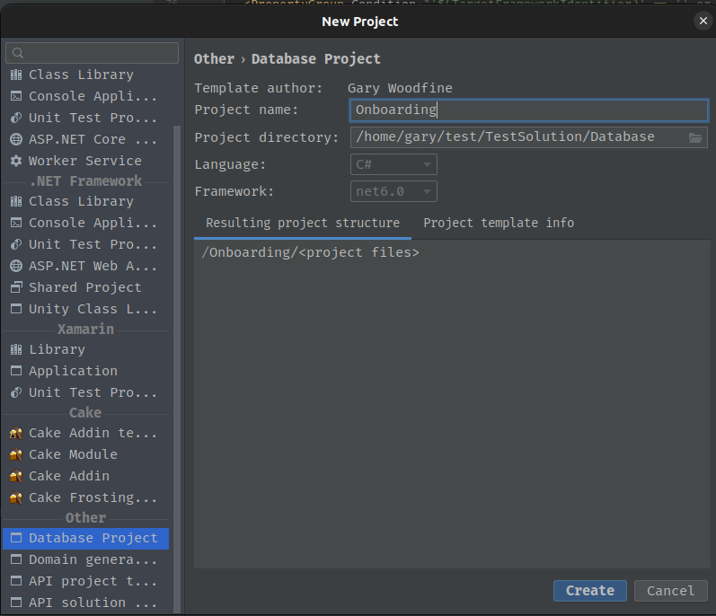

# Database project template

The Database project template aims to make creating a new database project for your microservice is as easy as possible.

```shell
dotnet new database -n [Name of your Database]  -o [output location]
```

Using Rider project wizard 



