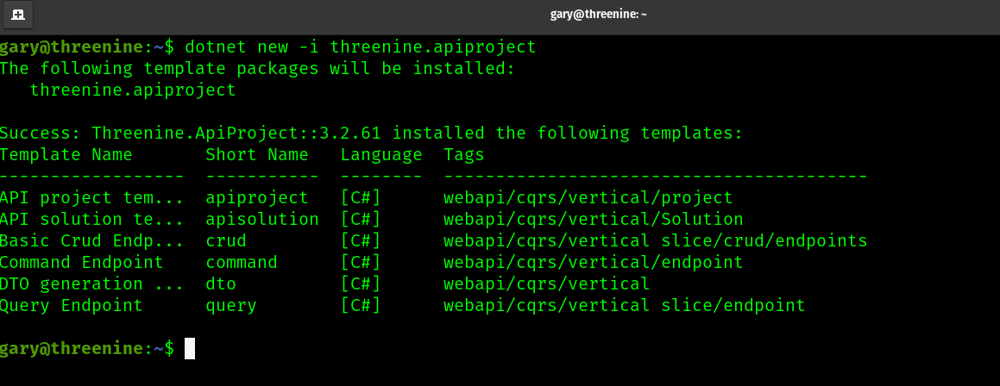

# Getting Started with API Template Pack

The API Template Pack is available as a Custom template for `dotnet new`  via nuget package. 

[Custom templates](https://docs.microsoft.com/en-us/dotnet/core/tools/custom-templates) enable you to install from a NuGet package on any NuGet feed, by referencing a NuGet `.nupkg` file directly, or by specifying a file system directory that contains the template.

### Installation

To install the API Template Pack you can simply do so by opening a terminal window and executing the following dotnet command line

```shell

dotnet new -i Threenine.ApiProject

```

This will install a number of Solution, Project and Item templates that you can then use to generate the items you would like to use.

Once the API Template pack is successfully installed  you should be able to use the `dotnet new -l` to list the options that will now be available.




### Uninstall 

Should for you for whatever reason need to uninstall the API Template pack this can be achieved by simply executing
```shell

dotnet new -u Threenine.ApiProject

```