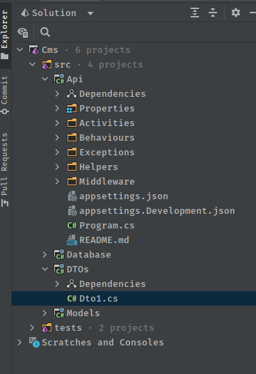
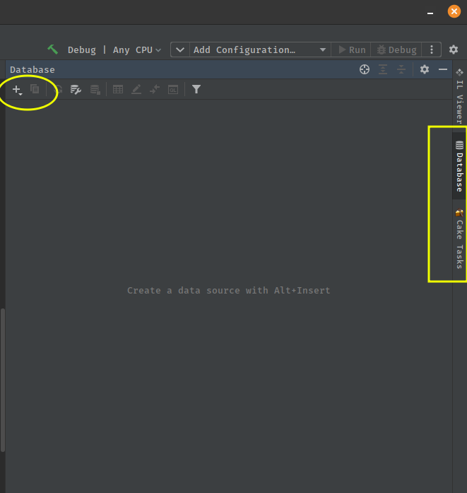
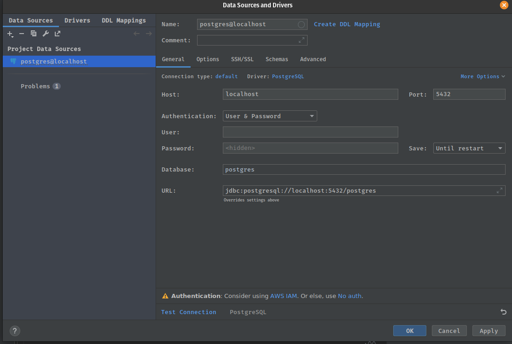
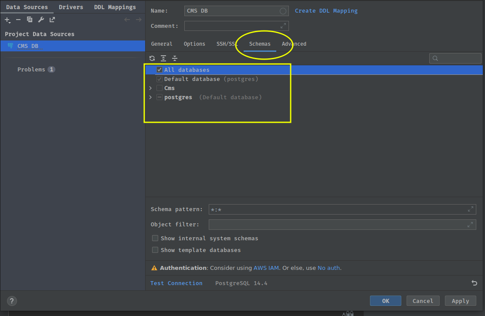

# How to start a new API Solution using API Template Pack

The primary objective of the API Template Pack is to enable developers to be able to quickly and easily start new API projects by attempting to automate most of the grunt work required to get a new projects up running and also to provide useful tools to automate all the boiler plate tasks, enabling developers to focus on the tasks that actually generate value.

The API Template pack enables the creation of project that utilise the best of breed solutions available in the .net ecosystem. API Template pack aims to set the projects up for you and get out of your way and enable you to focus on using the tools with them all preconfigured and ready to go. With every release of the API Template Pack we will endeavour to further improve on this mission.

Many of the decisions and configuration options that have been implemented in the API Template pack have been from our own experience that have worked well for us on projects.

The typical API Template Pack solution come preconfigured with Logging, EntityFramework, Validation, Mapping, Unit Testing tools and more. We attempt to provide an entire local Docker Compose development environment with a PostgreSQL database and Seq as your centralised logging dashboard. We will be adding more as this project continues to evolve.

### Start a new Solution

Once you have [installed the API Template Pack](../start/getting-started "Install API Template Pack") you ready to start generating your new project.

For the purpose of this tutorial we're going to assume you are working Ubuntu and using [Jetbrains Rider IDE](https://www.jetbrains.com/rider/), but the steps will be exactly the same on whichever [operating system with  .net 6 installed](https://docs.microsoft.com/en-us/dotnet/core/install/windows?tabs=net60).

The project will start developing in this walk-through tutorial is a hypothetical Headless Content Management System for a Geek News service, for a *Geekiam*.  We'll be outputting our solution to a code folder and sub directory named `Cms`

The full source Code for this  tutorial and is available at [Geek-I-Am
/
cms
](https://github.com/Geek-I-Am/cms)

To start the project we'll simply use the command below, the command switches are discussed in [API Solution Template](../../start/api-solution).

```shell

dotnet new apisolution -n Cms --Root Geekiam -o code/cms

```

We can  now open our Solution file in Rider to inspect the generated projects.



We have successfully generated our project and can set up our local develop environment we'll need to start developing.  We will need to get our preferred Database setup. API Template pack has chosen to use PostgreSQL as our preferred database system. To understand more about this specific choice of please read [Why use PostgreSQL for your database](../knowledge/postgres.md)

To get Postgres up and running is as simple as starting the Docker Compose. Our preferred means of doing is using [How to run docker compose files in Rider](https://garywoodfine.com/how-to-run-docker-compose-files-in-rider/)

Should you not want to use this method you could make use of `docker compose up -d` on your terminal.

In the current implementation this  will spin up 2 systems that the API Template pack utilises.

- [PostgresSQL database](../knowledge/postgres.md)
- [SEQ Centralised Logging](https://datalust.co/seq) 

## Root Namespace

Before we proceed to connecting to the Database it is worth taken time to understand the purpose of the `--Root` switch. Primarily this is used to set the Root Namespace of your Solution, so all assemblies of your Solution will reside under specific namespace. This is implmented in the `Directory.Build.props` file of the solution, so you can change this at anytime without having to change multiple files. 

[Learn more about Directory.Build.props](https://garywoodfine.com/what-is-this-directory-build-props-file-all-about "What is this Directory.Build.props file all about? - Gary Woodfine")

# Connect to the Database

By default for ease of development the Database connectivity has been  defined, the Docker Compose file references a `.env` file which contain some of the connectivity, which will have the same name as your solution.

```shell
POSTGRES_USER=Cms
POSTGRES_PASSWORD=Password12@
POSTGRES_DB=Cms
PGDATA: /data/postgres
```

The `appsettings.Development.json` will have the database connection defined which will enable the application to communicate the database out the box.

```json
 "ConnectionStrings": {
    "Local_DB": "User ID=Cms;Password=Password12@;Host=localhost;Port=5432;Database=Cms;Pooling=true;Integrated Security=true;"
  },
```

For the development purposes you will probably not need to touch these settings and you will just be able  to carry on with your development.

Using Rider you will be able to connect to your Database directly in your IDE, this will come in really handy later in your Development cycle to inspect your database changes and migrations.

To connect your Database simply open the Database View and Select the '+' icon.  Search for PostgreSQL in 



This will open a Database connection details screen, in which you should enter the details supplied in the `.env` 



You should be able to test your connection and it should succeed


Once you're connected you can then go select the schemas you're going to interested in monitoring. In our case it is going to be the *Cms* but we will select all databases.



### Building your Models and Database

We can now start defining our Models for our database. An Entity Framework Core model is a conceptual model of an application's domain. 

The domain includes all topics relevant to the problem solving areas of interest to the application users. The model includes data and can also include behaviour. _Typically, models for CRUD applications don't tend to incorporate a lot of behaviour_.

When developing API's we tend not to want to include any behaviours in our models, and our Models should mostly CRUD (Create, Read, Update, Delete) Focused.

The API Template Pack provides a Dedicated project to enable you to define your Models. This project is the `Models.csproj` .

Currently, by default API Template Pack attempts to pluralise your namespace for your Models and creates a folder for you to start adding your models.
 
We will add our first Model in this folder which we will name `Content`,which will primarily be Bucket for all types of Content in our system , i.e. Blog Posts, Pages, Articles etc.  All these items will primarily contain a number of the same attributes shared.

So we can simply add a C# class file and name it `Content.cs`. Once the class is created we will also now also make use of one of the features that comes with API Template Pack.  In a vast majority of cases, a Model class will need some typical attributes appended to it.  Such as an Id property, typical base audit tracking features like a Created and Modified date  and Active field to enable Soft Delete.  This will mostly need to be consistent throughout your System.

We can simplify this process by making use of the BaseEntity abstract class which has all these properties pre-defined for us. All we need to do is inherit this class in our new `Content.cs`.

`BaseEntity` will be in the `Threenine.Models` namespace that is already referenced in your `Models.csproj`.

```csharp
public class Content : BaseEntity
{
    public string Title { get; set; }
    public string Summary { get; set; }
    public string Body { get; set; }
}

```

We will need a means to tag particular content so we will create a `Tags` Model

```csharp
public class Tag : BaseEntity
{
    public string Name { get; set; }
    public string Permalink { get; set; }    
}
```

We will also need a mechanism to associate tags to content which will be a many to many relationship

```csharp
public class ContentTags
{
    public Guid ContentId { get; set; }
    public Guid TagId { get; set; }
    
}
```


# Entity Type Configuration

This is an area that the API Template Pack takes an opinionated stance, as we prefer making use of the Fluent Configurations over the Data Annotations, and this is due to the fact that the Fluent Configurations are purely far more powerful from a functionality perspective. In our opinion, the Fluent Configurations are also far more readable and understandable.

The downsides to the Data Annotations relationships are all about conventions so breaking that is extremely hard whereas in Fluent Configuration it’s really easy. Microsoft have also admitted that Fluent Configuration for EF Core is an “Advanced” feature.

We also take the opinion that Fluent Configurations are far closer to Clean Code principles. 

The Database project is configured by default to make use of the Fluent Configuration and the API Template pack has some built in features to further make this easier for developers.
 
For our simple project we'll add some Entity Type Configurations by making use of one of these features.

We'll  create our first Entity Type Configuration by adding a new File to the `Database -> Configurations` folder and name it `ContentConfiguration.cs`

We'll update the file with the following

```csharp
using Microsoft.EntityFrameworkCore;
using Microsoft.EntityFrameworkCore.Metadata.Builders;
using Models.Cms;
using Threenine.Configurations.PostgreSql;

namespace Database.Cmss.Configurations;

public class ContentConfiguration : BaseEntityTypeConfiguration<Content>
{
    public override void Configure(EntityTypeBuilder<Content> builder)
    {
        builder.ToTable(nameof(Content));
       
        builder.Property(x => x.Title)
            .HasColumnType(ColumnTypes.Varchar)
            .HasMaxLength(75)
            .IsRequired();

        builder.Property(x => x.Summary)
            .HasColumnType(ColumnTypes.Varchar)
            .HasMaxLength(300)
            .IsRequired();

        builder.Property(x => x.Body)
            .HasColumnType(ColumnTypes.Text);
    }
}
```

A key points to note with the changes we implement in this file is that, as you may remember when we created our `Content` model we inherited the `BaseEntity`  type. Which inludes some default properties on our class.  You'll notice that `ContentConfiguration` inherits the `BaseEntityTypeConfiguration` which will automatically configure these fields for us on our entity enabling us to purely focus on the fields we need to configure.

We also need to mention a feature of the library that helps to eliminate the use of Magic Strings within our configurations, when we make use of `ColumnTypes`  which we import using the `Threenine.Configurations.PostgreSql` namespace.  This namespace includes all the possible Postgres data types you're likely to use in the tables of your API.

