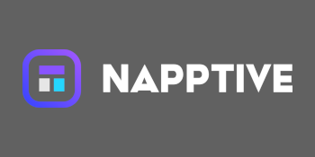

   
  

 **Documentation:** [API Template Pack](https://www.apitemplatepack.com/docs/introduction)

 **Source Code:** [https://github.com/threenine/api-template](https://github.com/threenine/api-template)

 API Template Pack is modern, fast web framework for building API and microservices with dotnet framework and C# with a focus on implementing secure, stable, cross platform and performant services using trusted and reliable patterns & practices and tools.
 
### Key Features

* **Fast:** High performance using the dotnet frame
* **Cross platform:** Supported on Windows, Linux, and macOS Build apps for any device Build native apps for Android, iOS, macOS and Windows from a single codebase with .NET Multi-platform 
* **Fast to code:** Increase the speed to develop features by about 200% to 300%.
* **Fewer Bugs:** Reduce about 40% of human induced errors.
* **Intuitive:** Reuse and implement common patterns and practices
* **Easy:** Designed to be easy to use and learn. Less time reading docs.
* **Robust:** Develop production ready code 
* **Standards based:** : Based on the open standards for APIs: OpenAPI and JSON Schema.

### Sponsored by

 
 

